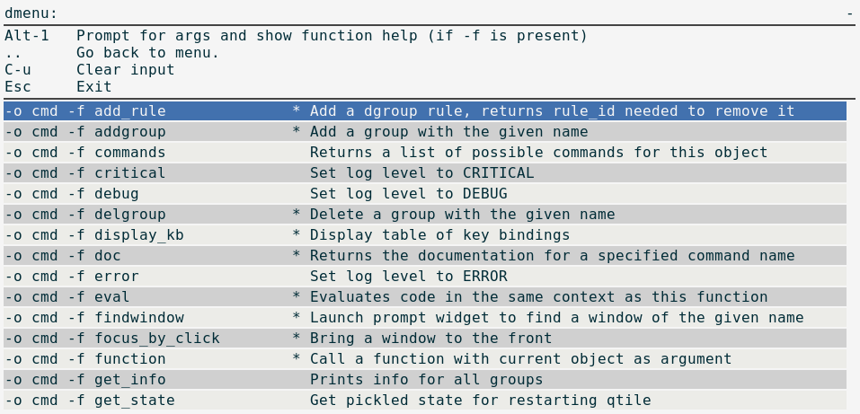

dqcmd
=====

A Rofi/dmenu interface to qcmd. Excepts all arguments o qcmd.

Examples:
---------

Output of ``dqcmd -o cmd``
~~~~~~~~~~~~~~~~~~~~~~~~~~

Output of ``dqcmd -h``
~~~~~~~~~~~~~~~~~~~~~~

.. code:: text

    dqcmd

        A Rofi/dmenu interface to qcmd. Excepts all arguments o qcmd (see below).

    usage: dqcmd [-h] [--object OBJ_SPEC [OBJ_SPEC ...]] [--function FUNCTION]
                [--args ARGS [ARGS ...]] [--info]

    Simple tool to expose qtile.command functionality to shell.

    optional arguments:
      -h, --help            show this help message and exit
      --object OBJ_SPEC [OBJ_SPEC ...], -o OBJ_SPEC [OBJ_SPEC ...]
                            Specify path to object (space separated). If no
                            --function flag display available commands.
      --function FUNCTION, -f FUNCTION
                            Select function to execute.
      --args ARGS [ARGS ...], -a ARGS [ARGS ...]
                            Set arguments supplied to function.
      --info, -i            With both --object and --function args prints
                            documentation for function.

    Examples:
     dqcmd
     dqcmd -o cmd
     dqcmd -o cmd -f prev_layout -i
     dqcmd -o cmd -f prev_layout -a 3 # prev_layout on group 3
     dqcmd -o group 3 -f focus_back
