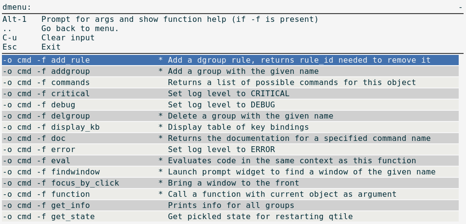

dqtile-cmd
==========

A Rofi/dmenu interface to qtile-cmd. Accepts all arguments of qtile-cmd.

Examples:
---------

Output of ``dqtile-cmd -o cmd``
~~~~~~~~~~~~~~~~~~~~~~~~~~~~~~~

Output of ``dqtile-cmd -h``
~~~~~~~~~~~~~~~~~~~~~~~~~~~

.. code:: text

    dqtile-cmd

        A Rofi/dmenu interface to qtile-cmd. Excepts all arguments of qtile-cmd
        (see below).

    usage: dqtile-cmd [-h] [--object OBJ_SPEC [OBJ_SPEC ...]]
                      [--function FUNCTION] [--args ARGS [ARGS ...]] [--info]

    Simple tool to expose qtile.command functionality to shell.

    optional arguments:
      -h, --help            show this help message and exit
      --object OBJ_SPEC [OBJ_SPEC ...], -o OBJ_SPEC [OBJ_SPEC ...]
                            Specify path to object (space separated). If no
                            --function flag display available commands.
      --function FUNCTION, -f FUNCTION
                            Select function to execute.
      --args ARGS [ARGS ...], -a ARGS [ARGS ...]
                            Set arguments supplied to function.
      --info, -i            With both --object and --function args prints
                            documentation for function.

    Examples:
     dqtile-cmd
     dqtile-cmd -o cmd
     dqtile-cmd -o cmd -f prev_layout -i
     dqtile-cmd -o cmd -f prev_layout -a 3 # prev_layout on group 3
     dqtile-cmd -o group 3 -f focus_back

    If both rofi and dmenu are present rofi will be selected as default, to change this us --force-dmenu as the first argument.
