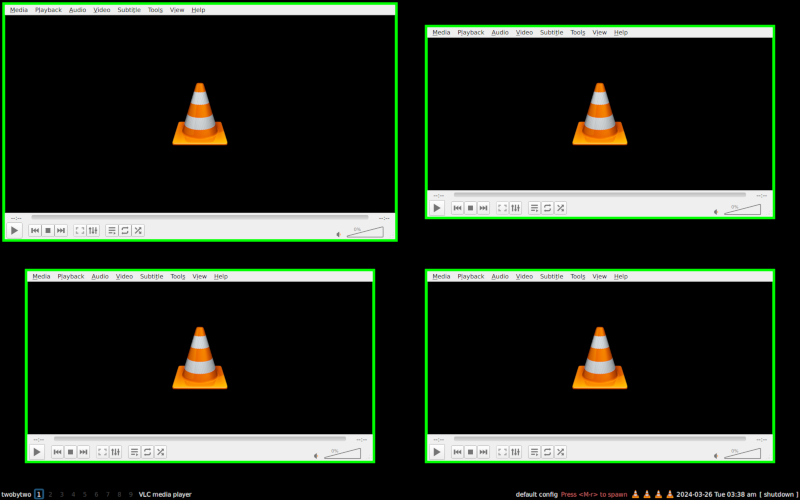

.. _layout-creation:

======================
How to create a layout
======================

The aim of this page is to explain the main components of qtile layouts, how
they work, and how you can use them to create your own layouts or hack existing
layouts to make them work the way you want them.

.. note::
    It is highly recommended that users wishing to create their own layout refer
    to the source documentation of existing layouts to familiarise themselves with
    the code.

What is a layout?
=================

In Qtile, a layout is essentially a set of rules that determine how windows should be
displayed on the screen. The layout is responsible for positioning all windows other than
floating windows, "static" windows, internal windows (e.g. the bar) and windows that have
requested not to be managed by the window manager.

Base classes
============

To simplify the creation of layouts, a couple of base classes are available to users.

The ``Layout`` class
~~~~~~~~~~~~~~~~~~~~

As a bare minimum, all layouts should inherit the base ``Layout`` class object as this
class defines a number of methods required for basic usage and will also raise errors if the
required methods are not implemented. Further information on these required methods is set out
below.

The ``_SimpleLayoutBase`` class
~~~~~~~~~~~~~~~~~~~~~~~~~~~~~~~

This class implements everything needed for a basic layout with the exception of the
``configure`` method. Therefore, unless your layout requires special logic for updating
and navigating the list of clients, it is strongly recommended that your layout inherits
this base class 

The ``_ClientList`` class
~~~~~~~~~~~~~~~~~~~~~~~~~

This class defines a list of clients and the current client.

The collection is meant as a base or utility class for special layouts,
which need to maintain one or several collections of windows, for example
Columns or Stack, which use this class as base for their internal helper.

The property ``current_index`` get and set the index to the current client,
whereas ``current_client`` property can be used with clients directly.

Required methods
================

To create a minimal, functioning layout your layout must include the methods listed below:

* ``__init__``
* ``configure``
* ``add_client``
* ``remove``
* ``focus_first``
* ``focus_last``
* ``focus_next``
* ``focus_previous``
* ``next``
* ``previous``

As noted above, if you create a layout based on the ``_SimpleLayoutBase`` class, you will only
need to define ``configure`` (and ``_init__``, if you have custom parameters). However, for the
purposes of this document, we will show examples of all required methods.

``__init__``
~~~~~~~~~~~~

Initialise your layout's variables here. The main use of this method will be to load
any default parameters defined by layout. These are defined in a class attribute called
``defaults``. The format of this attribute is a list of tuples.

.. code:: python

    from libqtile.layout import base

    class TwoByTwo(base.Layout):
        """
        A simple layout with a fixed two by two grid.

        By default, unfocused windows are smaller than the focused window.
        """
        defaults = [
            ("border_width", 5, "Window border width"),
            ("border_colour", "00ff00", "Window border colour"),
            ("margin_focused", 5, "Margin width for focused windows"),
            ("margin_unfocused", 50, "Margin width for unfocused windows")
        ]

        def __init__(self, **config):
            base.Layout.__init__(self, **config)
            self.add_defaults(TwoByTwo.defaults)
            self.clients = []
            self.current_client = None

Once the layouts is initialised, these parameters are available at
``self.border_width`` etc.

``configure``
~~~~~~~~~~~~~

This is where the magic happens! This method is responsible for determining how to position
a window on the screen.

This method should therefore configure the dimensions and borders of a window using the
window's ``.place()`` method. The layout can also call either ``hide()`` or ``.unhide()``
on the window.

.. code:: python

    def configure(self, client: Window, screen_rect: ScreenRect) -> None:
        """Simple example breaking screen into four quarters."""
        try:
            index = self.clients.index(client)
        except ValueError:
            # Layout not expecting this window so ignore it
            return

        # We're only showing first 4 windows
        if index > 3:
            client.hide()
            return

        # Unhide the window in case it was hiddent before
        client.unhide()

        # List to help us calculate x and y values of 
        quarters = [
            (0, 0),
            (0.5, 0),
            (0, 0.5),
            (0.5, 0.5)
        ]

        # Calculate size and position for each window
        xpos, ypos = quarters[index]

        x = int(screen_rect.width * xpos) + screen_rect.x
        y = int(screen_rect.height * ypos) + screen_rect.y
        w = screen_rect.width // 2
        h = screen_rect.height // 2

        if client is self.current_client:
            margin = self.margin_focused
        else:
            margin = self.margin_unfocused

        client.place(
            x,
            y,
            w - self.border_width * 2,
            h - self.border_width * 2,
            self.border_width,
            self.border_colour,
            margin=[margin] * 4,
        )

``add_client``
~~~~~~~~~~~~~~

This method is called whenever a window is added to the group, regardless of
whether the layout is current or not. The layout should just add the window to
its internal datastructures, without mapping or configuring/displaying.

.. code:: python

    def add_client(self, client: Window) -> None:
        # Assumes self.clients is simple list
        self.clients.insert(0, client)
        self.current_client = client

``remove``
~~~~~~~~~~

This method is called whenever a window is removed from the group, regardless 
of whether the layout is current or not. The layout should just
de-register the window from its data structures, without unmapping the
window.

The method must also return the "next" window that should gain focus or ``None``
if there are no other windows.

.. code:: python

    def remove(self, client: Window) -> Window | None:
        # Assumes self.clients is a simple list
        # Client already removed so ignore this
        if client not in self.clients:
            return None
        # Client is only window in the list
        elif len(self.clients) == 1:
            self.clients.remove(client)
            self.current_client = None
            # There are no other windows so return None
            return None
        else:
            # Find position of client in our list
            index = self.clients.index(client)
            # Remove client
            self.clients.remove(client)
            # Ensure the index value is not greater than list size
            # i.e. if we closed the last window in the list, we need to return
            # the first one (index 0).
            index %= len(self.clients)
            next_client = self.clients[index]
            self.current_client = next_client
            return next_client

``focus_first``
~~~~~~~~~~~~~~~

This method is called when the first client in the layout should be focused.

This method should just return the first client in the layout, if any. NB the method
should not focus the client itself, this is done by caller.

.. code:: python

    def focus_first(self) -> Window | None:
        if not self.clients:
            return None

        return self.client[0]

``focus_last``
~~~~~~~~~~~~~~

This method is called when the last client in the layout should be focused.

This method should just return the last client in the layout, if any. NB the method
should not focus the client itself, this is done by caller.

.. code:: python

    def focus_last(self) -> Window | None:
        if not self.clients:
            return None

        return self.client[-1]

``focus_next``
~~~~~~~~~~~~~~

This method is called the next client in the layout should be focused.

This method should return the next client in the layout, if any. NB the layout
should not cycle clients when reaching the end of the list as there are other method in
the group for cycling windows which focus floating windows once the the end of the tiled
client list is reached.

In addition, the method should not focus the client.

.. code:: python

    def focus_next(self, win: Window) -> Window | None:
        try:
            return self.clients[self.clients.index(win) + 1]
        except IndexError:
            return None

``focus_previous``
~~~~~~~~~~~~~~~~~~

This method is called the previous client in the layout should be focused.

This method should return the previous client in the layout, if any. NB the layout
should not cycle clients when reaching the end of the list as there are other method in
the group for cycling windows which focus floating windows once the the end of the tiled
client list is reached.

In addition, the method should not focus the client.

.. code:: python

    def focus_previous(self, win: Window) -> Window | None:
        if not self.clients or self.clients.index(win) == 0
            return None

        try:
            return self.clients[self.clients.index(win) - 1]
        except IndexError:
            return None

``next``
~~~~~~~~

This method focuses the next tiled window and can cycle back to the beginning of the list.

.. code:: python

    def next(self) -> None:
        if self.current_client is None:
            return
        # Get the next client or, if at the end of the list, get the first
        client = self.focus_next(self.current_client) or self.focus_first()
        self.group.focus(client, True)

``previous``
~~~~~~~~~~~~

This method focuses the previous tiled window and can cycle back to the end of the list.

.. code:: python

    def previous(self) -> None:
        if self.current_client is None:
            return
        # Get the previous client or, if at the end of the list, get the last
        client = self.focus_previous(self.current_client) or self.focus_last()
        self.group.focus(client, True)

Additional methods
==================

While not essential to implement, the following methods can also be defined:

* ``clone``
* ``show``
* ``hide``
* ``swap``
* ``focus``
* ``blur``

``clone``
~~~~~~~~~

Each group gets a copy of the layout. The ``clone`` method is used to create this copy. The default
implementation in ``Layout`` is as follows:

.. code:: python

    def clone(self, group: _Group) -> Self:
        c = copy.copy(self)
        c._group = group
        return c

``show``
~~~~~~~~

This method can be used to run code when the layout is being displayed. The method receives one argument,
the ``ScreenRect`` for the screen showing the layout.

The default implementation is a no-op:

.. code:: python

    def show(self, screen_rect: ScreenRect) -> None:
        pass

``hide``
~~~~~~~~

This method can be used to run code when the layout is being hidden.

The default implementation is a no-op:

.. code:: python

    def hide(self) -> None:
        pass

``swap``
~~~~~~~~

This method is used to change the position of two windows in the layout.

.. code:: python

    def swap(self, c1: Window, c2: Window) -> None:
        if c1 not in self.clients and c2 not in self.clients:
            return

        index1 = self.clients.index(c1)
        index2 = self.clients.index(c2)

        self.clients[index1], self.clients[index2] = self.clients[index2], self.clients[index1]

``focus``
~~~~~~~~~

This method is called when a given window is being focused.

.. code:: python

    def focus(self, client: Window) -> None:
        if client not in self.clients:
            self.current_client = None
            return

        index = self.clients.index(client)

        # Check if window is not visible
        if index > 3:
            c = self.clients.pop(index)
            self.clients.insert(0, c)

        self.current_client = client

``blur``
~~~~~~~~

This method is called when the layout loses focus.

.. code:: python

    def blur(self) -> None:
        self.current_client = None

Adding commands
===============

Adding commands allows users to modify the behaviour of the layout. To make commands
available via the command interface (e.g. via ``lazy.layout`` calls), the layout must
include the following import:

.. code:: python

    from libqtile.command.base import expose_command

Commands are then decorated with ``@expose_command``. For example:

.. code:: python

    @expose_command
    def rotate(self, clockwise: bool = True) -> None:
        if not self.clients:
            return

        if clockwise:
            client = self.clients.pop(-1)
            self.clients.insert(0, client)
        else:
            client = self.clients.pop(0)
            self.clients.append(client)

        # Check if current client has been rotated off the screen
        if self.current_client and self.clients.index(self.current_client) > 3:
            if clockwise:
                self.current_client = self.clients[3]
            else:
                self.current_client = self.clients[0]

        # Redraw the layout
        self.group.layout_all()

The ``info`` command
~~~~~~~~~~~~~~~~~~~~

Layouts should also implement an ``info`` method to provide information about the layout.

As a minimum, the test suite (see below) will expect a layout to return the following information:

* Its name
* Its group
* The clients managed by the layout

NB the last item is not included in ``Layout``'s implementation of the method so it should be added
when defining a class that inherits that base.

.. code:: python

    @expose_command
    def info(self) -> dict[str, Any]:
        inf = base.Layout.info(self)
        inf["clients"] = self.clients
        return inf

Adding layout to main repo
==========================

If you think your layout is amazing and you want to share with other users by including it in the
main repo then there are a couple of extra steps that you need to take.

Add to list of layouts
~~~~~~~~~~~~~~~~~~~~~~

You must save the layout in ``libqtile/layout`` and then add a line importing the layout definition
to ``libqtile/layout/__init__.py`` e.g.

.. code:: python

    from libqtile.layout.twobytwo import TwoByTwo

Add tests
~~~~~~~~~

Basic functionality for all layouts is handled automatically by the core test suite. However, you
should create tests for any custom functionality of your layout (e.g. testing the ``rotate`` command
defined above).

Full example
============

The full code for the example layout is as follows:

.. code:: python

    from __future__ import annotations

    from typing import TYPE_CHECKING

    from libqtile.command.base import expose_command
    from libqtile.layout import base

    if TYPE_CHECKING:
        from libqtile.backend.base import Window
        from libqtile.config import ScreenRect
        from libqtile.group import _Group

    class TwoByTwo(base.Layout):
        """
        A simple layout with a fixed two by two grid.

        By default, unfocused windows are smaller than the focused window.
        """
        defaults = [
            ("border_width", 5, "Window border width"),
            ("border_colour", "00ff00", "Window border colour"),
            ("margin_focused", 5, "Margin width for focused windows"),
            ("margin_unfocused", 50, "Margin width for unfocused windows")
        ]

        def __init__(self, **config):
            base.Layout.__init__(self, **config)
            self.add_defaults(TwoByTwo.defaults)
            self.clients = []
            self.current_client = None

        def configure(self, client: Window, screen_rect: ScreenRect) -> None:
            """Simple example breaking screen into four quarters."""
            try:
                index = self.clients.index(client)
            except ValueError:
                # Layout not expecting this window so ignore it
                return

            # We're only showing first 4 windows
            if index > 3:
                client.hide()
                return

            # Unhide the window in case it was hiddent before
            client.unhide()

            # List to help us calculate x and y values of 
            quarters = [
                (0, 0),
                (0.5, 0),
                (0, 0.5),
                (0.5, 0.5)
            ]

            # Calculate size and position for each window
            xpos, ypos = quarters[index]

            x = int(screen_rect.width * xpos) + screen_rect.x
            y = int(screen_rect.height * ypos) + screen_rect.y
            w = screen_rect.width // 2
            h = screen_rect.height // 2

            if client is self.current_client:
                margin = self.margin_focused
            else:
                margin = self.margin_unfocused

            client.place(
                x,
                y,
                w - self.border_width * 2,
                h - self.border_width * 2,
                self.border_width,
                self.border_colour,
                margin=[margin] * 4,
            )

        def add_client(self, client: Window) -> None:
            # Assumes self.clients is simple list
            self.clients.insert(0, client)
            self.current_client = client

        def remove(self, client: Window) -> Window | None:
            # Assumes self.clients is a simple list
            # Client already removed so ignore this
            if client not in self.clients:
                return None
            # Client is only window in the list
            elif len(self.clients) == 1:
                self.clients.remove(client)
                self.current_client = None
                # There are no other windows so return None
                return None
            else:
                # Find position of client in our list
                index = self.clients.index(client)
                # Remove client
                self.clients.remove(client)
                # Ensure the index value is not greater than list size
                # i.e. if we closed the last window in the list, we need to return
                # the first one (index 0).
                index %= len(self.clients)
                next_client = self.clients[index]
                self.current_client = next_client
                return next_client

        def focus_first(self) -> Window | None:
            if not self.clients:
                return None

            return self.client[0]

        def focus_last(self) -> Window | None:
            if not self.clients:
                return None

            return self.client[-1]

        def focus_next(self, win: Window) -> Window | None:
            try:
                return self.clients[self.clients.index(win) + 1]
            except IndexError:
                return None

        def focus_previous(self, win: Window) -> Window | None:
            if not self.clients or self.clients.index(win) == 0:
                return None

            try:
                return self.clients[self.clients.index(win) - 1]
            except IndexError:
                return None

        def next(self) -> None:
            if self.current_client is None:
                return
            # Get the next client or, if at the end of the list, get the first
            client = self.focus_next(self.current_client) or self.focus_first()
            self.group.focus(client, True)

        def previous(self) -> None:
            if self.current_client is None:
                return
            # Get the previous client or, if at the end of the list, get the last
            client = self.focus_previous(self.current_client) or self.focus_last()
            self.group.focus(client, True)

        def swap(self, c1: Window, c2: Window) -> None:
            if c1 not in self.clients and c2 not in self.clients:
                return

            index1 = self.clients.index(c1)
            index2 = self.clients.index(c2)

            self.clients[index1], self.clients[index2] = self.clients[index2], self.clients[index1]

        def focus(self, client: Window) -> None:
            if client not in self.clients:
                self.current_client = None
                return

            index = self.clients.index(client)

            # Check if window is not visible
            if index > 3:
                c = self.clients.pop(index)
                self.clients.insert(0, c)

            self.current_client = client

        def blur(self) -> None:
            self.current_client = None

        @expose_command
        def rotate(self, clockwise: bool = True) -> None:
            if not self.clients:
                return

            if clockwise:
                client = self.clients.pop(-1)
                self.clients.insert(0, client)
            else:
                client = self.clients.pop(0)
                self.clients.append(client)

            # Check if current client has been rotated off the screen
            if self.current_client and self.clients.index(self.current_client) > 3:
                if clockwise:
                    self.current_client = self.clients[3]
                else:
                    self.current_client = self.clients[0]

            # Redraw the layout
            self.group.layout_all()

        @expose_command
        def info(self) -> dict[str, Any]:
            inf = base.Layout.info(self)
            inf["clients"] = self.clients
            return inf

This should result in a layout looking like this: |layout_image|.

